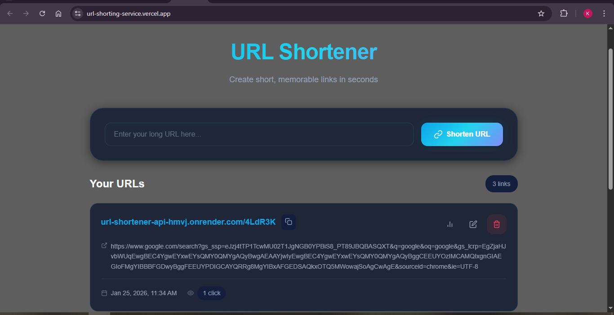

# URL Shortener Service

A full-stack URL shortening service with a RESTful API and React frontend. Create short, memorable links and track their usage statistics.

[Live Demo](https://url-shorting-service.vercel.app/)

##Screenshot


## Features

- ✅ Create short URLs from long URLs
- ✅ Retrieve original URLs from short codes
- ✅ Update existing short URLs
- ✅ Delete short URLs
- ✅ Track access statistics (click count)
- ✅ Automatic redirects to original URLs
- ✅ Modern React UI with dark theme

## Tech Stack

- **Backend**: Node.js, Express.js
- **Database**: PostgreSQL
- **Frontend**: React, Vite
- **Styling**: Vanilla CSS with modern design

## Project Structure

```
URL Shorting Service/
├── backend/
│   ├── server.js           # Express server
│   ├── db/
│   │   ├── index.js        # Database connection
│   │   └── schema.sql      # Database schema
│   ├── routes/urls.js      # API routes
│   ├── controllers/        # Business logic
│   └── utils/              # Utilities
├── frontend/
│   ├── src/
│   │   ├── App.jsx         # Main component
│   │   ├── components/     # React components
│   │   └── index.css       # Styles
│   └── vite.config.js      # Vite config
└── README.md
```

## Setup Instructions

### Prerequisites

- Node.js 18+
- PostgreSQL 14+

### Database Setup

1. Create a PostgreSQL database:

```sql
CREATE DATABASE url_shortener;
```

2. Run the schema:

```bash
cd backend
psql -U postgres -d url_shortener -f db/schema.sql
```

### Backend Setup

1. Navigate to backend directory:

```bash
cd backend
```

2. Install dependencies:

```bash
npm install
```

3. Create `.env` file:

```env
DB_HOST=localhost
DB_PORT=5432
DB_NAME=url_shortener
DB_USER=postgres
DB_PASSWORD=your_password
PORT=3001
BASE_URL=http://localhost:3001
```

4. Start the server:

```bash
npm run dev
```

Server runs at `http://localhost:3001`

### Frontend Setup

1. Navigate to frontend directory:

```bash
cd frontend
```

2. Install dependencies:

```bash
npm install
```

3. Start development server:

```bash
npm run dev
```

Frontend runs at `http://localhost:5173`

---

## API Documentation

### Base URL

```
http://localhost:3001/api
```

### Endpoints

#### Create Short URL

```http
POST /api/shorten
```

**Request Body:**

```json
{
  "url": "https://example.com/very/long/path"
}
```

**Response (201):**

```json
{
  "id": 1,
  "shortCode": "abc123",
  "shortUrl": "http://localhost:3001/abc123",
  "originalUrl": "https://example.com/very/long/path",
  "createdAt": "2026-01-22T11:00:00.000Z",
  "accessCount": 0
}
```

---

#### List All URLs

```http
GET /api/urls
```

**Response (200):**

```json
[
  {
    "id": 1,
    "shortCode": "abc123",
    "shortUrl": "http://localhost:3001/abc123",
    "originalUrl": "https://example.com/very/long/path",
    "createdAt": "2026-01-22T11:00:00.000Z",
    "updatedAt": "2026-01-22T11:00:00.000Z",
    "accessCount": 5
  }
]
```

---

#### Get URL Details

```http
GET /api/urls/:shortCode
```

**Response (200):**

```json
{
  "id": 1,
  "shortCode": "abc123",
  "shortUrl": "http://localhost:3001/abc123",
  "originalUrl": "https://example.com/very/long/path",
  "createdAt": "2026-01-22T11:00:00.000Z",
  "updatedAt": "2026-01-22T11:00:00.000Z",
  "accessCount": 5
}
```

**Response (404):**

```json
{
  "error": "Short URL not found"
}
```

---

#### Update URL

```http
PUT /api/urls/:shortCode
```

**Request Body:**

```json
{
  "url": "https://new-destination.com"
}
```

**Response (200):**

```json
{
  "id": 1,
  "shortCode": "abc123",
  "shortUrl": "http://localhost:3001/abc123",
  "originalUrl": "https://new-destination.com",
  "createdAt": "2026-01-22T11:00:00.000Z",
  "updatedAt": "2026-01-22T12:00:00.000Z",
  "accessCount": 5
}
```

---

#### Delete URL

```http
DELETE /api/urls/:shortCode
```

**Response (200):**

```json
{
  "message": "URL deleted successfully"
}
```

---

#### Get URL Statistics

```http
GET /api/urls/:shortCode/stats
```

**Response (200):**

```json
{
  "shortCode": "abc123",
  "shortUrl": "http://localhost:3001/abc123",
  "originalUrl": "https://example.com/very/long/path",
  "createdAt": "2026-01-22T11:00:00.000Z",
  "updatedAt": "2026-01-22T12:00:00.000Z",
  "accessCount": 5,
  "stats": {
    "totalClicks": 5,
    "createdAt": "2026-01-22T11:00:00.000Z",
    "lastUpdated": "2026-01-22T12:00:00.000Z"
  }
}
```

---

#### Redirect to Original URL

```http
GET /:shortCode
```

Redirects (301) to the original URL and increments the access count.

---

### Error Responses

All endpoints return errors in this format:

```json
{
  "error": "Error message description"
}
```

| Status | Description                               |
| ------ | ----------------------------------------- |
| 400    | Bad request (missing URL, invalid format) |
| 404    | Short URL not found                       |
| 500    | Internal server error                     |

---

## Testing with cURL

```bash
# Create a short URL
curl -X POST http://localhost:3001/api/shorten \
  -H "Content-Type: application/json" \
  -d '{"url": "https://github.com"}'

# List all URLs
curl http://localhost:3001/api/urls

# Get specific URL
curl http://localhost:3001/api/urls/abc123

# Update URL
curl -X PUT http://localhost:3001/api/urls/abc123 \
  -H "Content-Type: application/json" \
  -d '{"url": "https://gitlab.com"}'

# Get statistics
curl http://localhost:3001/api/urls/abc123/stats

# Delete URL
curl -X DELETE http://localhost:3001/api/urls/abc123
```

## License

MIT
